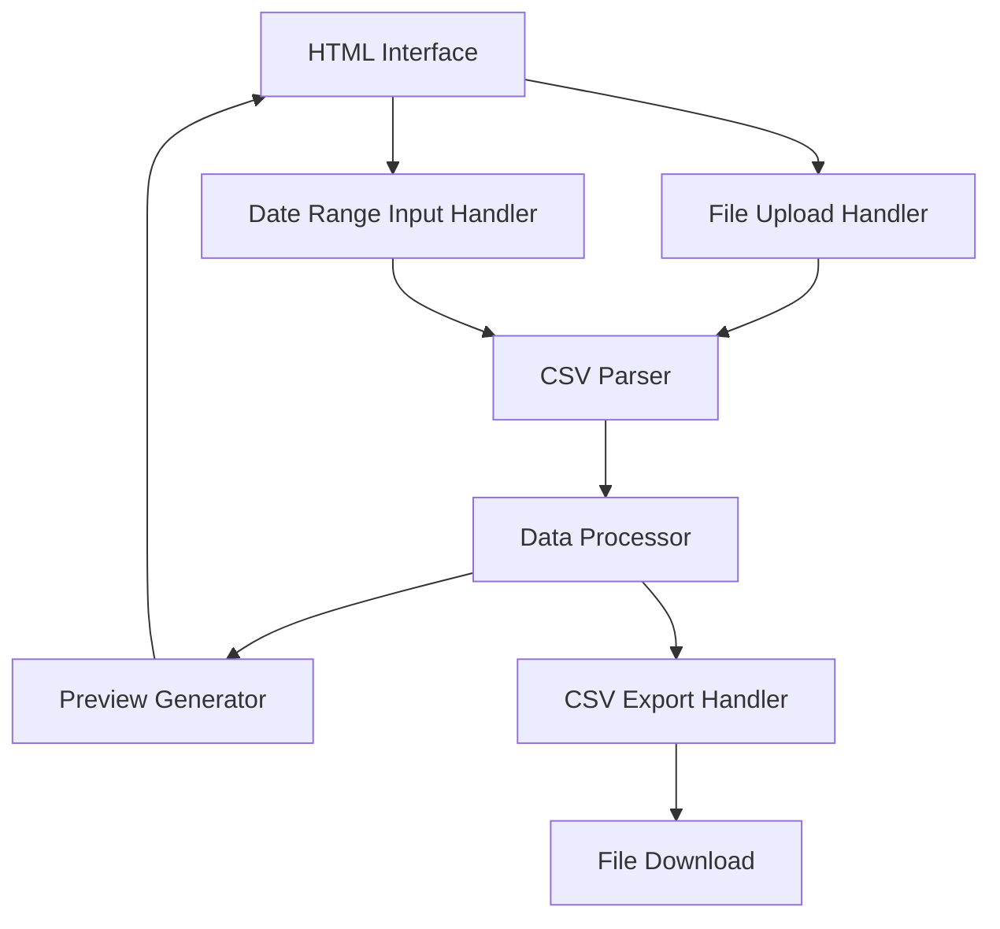

# Design Document

## Overview

The Timesheet Data Preparation Tool is a client-side web application built as a single HTML file. It provides a simple interface for uploading CSV files, adding date range information, and downloading processed files with month and year columns appended. The application uses vanilla JavaScript for CSV parsing and processing, with no external dependencies.

## Architecture

The application follows a simple client-side architecture:



### Key Components:
- **HTML Interface**: Form with file input, date inputs, and preview area
- **CSV Parser**: Parses uploaded CSV files into JavaScript objects
- **Data Processor**: Adds month and year columns to each row
- **Preview Generator**: Displays processed data in a table format
- **CSV Export Handler**: Converts processed data back to CSV format for download

## Components and Interfaces

### 1. User Interface Components

#### File Upload Section
- File input element (accepts .csv files only)
- Date range inputs (start date and end date)
- Process button (enabled when both file and dates are provided)

#### Preview Section
- Data table showing processed results
- Summary information (total rows, date range applied)
- Download button

#### Status/Error Display
- Error messages for invalid files or missing inputs
- Success messages for completed processing

### 2. Core JavaScript Modules

#### CSVParser
```javascript
class CSVParser {
  static parse(csvText) {
    // Parses CSV text into array of objects
    // Handles quoted fields and escaped commas
    // Returns: [{column1: value1, column2: value2, ...}, ...]
  }
  
  static stringify(dataArray) {
    // Converts array of objects back to CSV format
    // Properly escapes commas and quotes
    // Returns: CSV string
  }
}
```

#### DataProcessor
```javascript
class DataProcessor {
  static addDateColumns(data, startDate, endDate) {
    // Adds Month and Year columns to each row
    // Uses the provided date range to determine values
    // Returns: processed data array
  }
  
  static validateData(data) {
    // Validates that required columns exist
    // Checks for expected structure
    // Returns: validation result
  }
}
```

#### FileHandler
```javascript
class FileHandler {
  static readFile(file) {
    // Reads uploaded file as text
    // Returns: Promise<string>
  }
  
  static downloadCSV(data, originalFilename) {
    // Creates download link for processed CSV
    // Generates filename with _processed suffix
    // Triggers download
  }
}
```

## Data Models

### Input CSV Structure
Based on the sample data, the expected input format is:
```
Tracked by Name,Billable,Sum
John Doe,Yes,25.5
Jane Smith,No,18.25
```

### Processed Data Structure
After processing, each row will include additional columns:
```
Tracked by Name,Billable,Sum,Month,Year
John Doe,Yes,25.5,January,2024
Jane Smith,No,18.25,January,2024
```

### Internal Data Representation
```javascript
// Input data structure
const inputRow = {
  "Tracked by Name": "John Doe",
  "Billable": "Yes",
  "Sum": "25.5"
};

// Processed data structure
const processedRow = {
  "Tracked by Name": "John Doe",
  "Billable": "Yes", 
  "Sum": "25.5",
  "Month": "January",
  "Year": "2024"
};
```

## Error Handling

### File Upload Errors
- Invalid file type: Display error message, prevent processing
- Empty file: Display error message, prevent processing
- File read errors: Display technical error message

### CSV Parsing Errors
- Malformed CSV: Display error with line number if possible
- Missing required columns: Display error listing expected columns
- Empty CSV: Display error message

### Date Input Errors
- Missing date range: Display validation message
- Invalid date format: Browser validation handles this
- End date before start date: Display logical error message

### Processing Errors
- Memory limitations for large files: Display file size warning
- Browser compatibility issues: Display browser requirement message

## Testing Strategy

### Unit Testing Approach
Since this is a single HTML file, testing will be embedded within the application:

1. **CSV Parser Testing**
   - Test with various CSV formats (quoted fields, escaped commas)
   - Test with empty files and malformed data
   - Test round-trip parsing (parse then stringify)

2. **Data Processor Testing**
   - Test date column addition with various date ranges
   - Test with different month/year combinations
   - Test data preservation (original columns unchanged)

3. **File Handler Testing**
   - Test file reading with different file sizes
   - Test download functionality across browsers
   - Test filename generation logic

### Integration Testing
- End-to-end workflow testing with sample CSV files
- Cross-browser compatibility testing
- File size limitation testing

### User Acceptance Testing
- Test with actual timesheet data formats
- Verify processed files can be concatenated successfully
- Confirm downloaded files open correctly in Excel/analysis tools

## Implementation Notes

### Browser Compatibility
- Target modern browsers (Chrome 80+, Firefox 75+, Safari 13+)
- Use FileReader API for file handling
- Use Blob API for file downloads
- Avoid ES6+ features that aren't widely supported

### Performance Considerations
- Process files in chunks for large datasets (>1000 rows)
- Use setTimeout for non-blocking processing
- Display progress indicator for large files

### Security Considerations
- All processing occurs client-side (no data sent to servers)
- File type validation to prevent malicious uploads
- Input sanitization for CSV parsing
- No external dependencies to minimize attack surface

### Accessibility
- Proper form labels and ARIA attributes
- Keyboard navigation support
- Screen reader compatible error messages
- High contrast color scheme